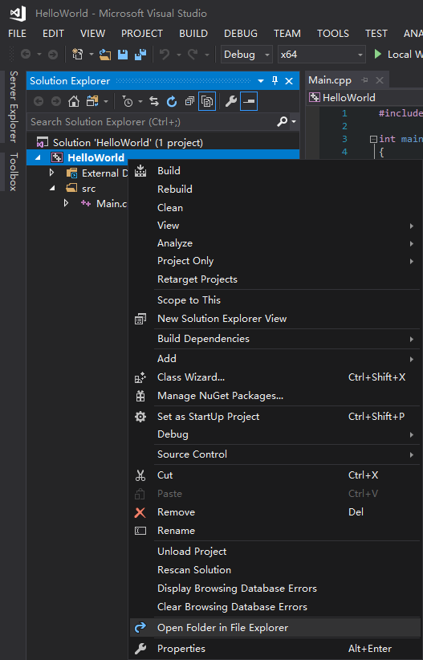
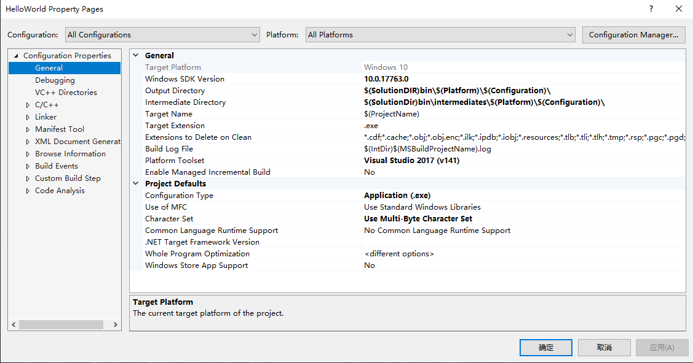

# Git

## 下载后的配置

下载好后
设置用户名和邮箱
    `$ git config --global user.name "Your Name"`
    `$ git config --global user.email "email@example.com"`
再安装一个SSHKEY，中途会让你设置一个密码，以后传文件只要对key的passphrase就行
    `ssh-keygen -t rsa -C "github账号的email"`
去github上设置这个key
    进入.ssh目录，复制 id_rsa.pub 内容到 github-->SSH and GPG keys 设置上面
设置好可以尝试连接github主站，会让输入passphrase密码
    `ssh -T git@github.com`

### 上传教程

第一次上传

```
echo "# -" >> README.md
git init
git add README.md
git commit -m "first commit"
git branch -M "main"
git remote add origin git@github.com:InkSpade/-.git		（使用ssh的网址只要输入passphrase就行）
git push -u origin "main"
```

后面更新它

```
git add .   （.是所有文件加入进去）
git commit -m "x-th commit"    （提交注释）
git push origin master		
```

# VisualStudio

## 语法高亮

go to `thecherno.com/vs`to download the vs settings
put it into VS2017->settings

in VS, tools->import/export settings
import selected environment settings
No, import new
Browse the downloaded ChernoVS.vssettings(If have imported it is in My Settings)
Finish
Your settings were successfully imported from ChernoVS.vssettings.

## Setup for C++ Projects

右键项目，选择底部的Properties

然后将Configuration和Platform设置成All Configurations和All Platforms
然后将Output Directory和Intermediate Directory设置成图片中

